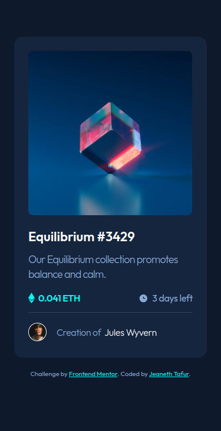
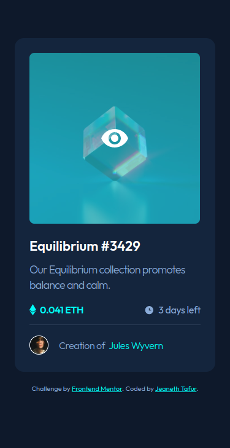
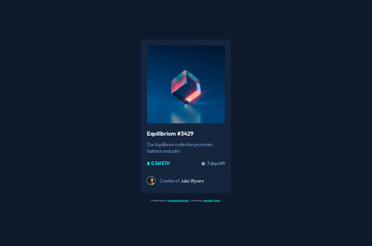

# Frontend Mentor - NFT preview card component solution

This is a solution to the [NFT preview card component challenge on Frontend Mentor](https://www.frontendmentor.io/challenges/nft-preview-card-component-SbdUL_w0U). 

## Table of contents

- [Overview](#overview)
  - [The challenge](#the-challenge)
  - [Screenshot](#screenshot)
  - [Links](#links)
- [My process](#my-process)
  - [Built with](#built-with)
  - [What I learned](#what-i-learned)
    - [:hover Selector](#hover-selector)
    - [Opacity Property](opacity-property)
- [Author](#author)

## Overview

### The challenge

Users should be able to:

- View the optimal layout depending on their device's screen size
- See hover states for interactive elements

### Screenshot

    



### Links

- Solution URL: [here](https://github.com/jtafurh/NTF-PREVIEW-CARD-COMPONENT/blob/main/README.md)
- Live Site URL: [here](https://jtafurh.github.io/NTF-PREVIEW-CARD-COMPONENT/)

## My process

### Built with

- Semantic HTML5 markup
- CSS custom properties
- Flexbox
- Mobile-first workflow

### What I learned

#### :hover Selector

  - Tells to apply certain styles when the mouse hovers over the container
  - All the effects indicated in the element:hover will only be visible when the mouse passes over said element.

  ```html
  <p> text text text</p>
  ```

  ```css
  p{
    background-color: yellow;
  }
  p:hover{
    background-color: blue;
    font-size:20px;
    color: white;
  }
  ```

#### Opacity Property

- Indicates the transparency level of the element.
- It will take values ​​from 0 to 1, where the lower the value, the more transparent the element will be.

  > Important:
  >
  > The content will be affected by the opacity property.
  >
  > Child elements will inherit the opacity property.


  ```html
  <h1>TEXT TEXT TEXT</h1>
  <h2>TEXT TEXT TEXT</h2>
  <p>TEXT TEXT TEXT</p>
  ```

  ```css
  h1{
    background-color: red;
    opacity: 1;
  }
  h2{
    background-color: red;
    opacity: 0.5;
  }
  p{
    background-color: red;
    opacity: 0.1;
  }
  ```

## Author

- Frontend Mentor - [@jtafurh](https://www.frontendmentor.io/profile/jtafurh)
- Twitter - [@jtafurh](https://www.twitter.com/jtafurh)
